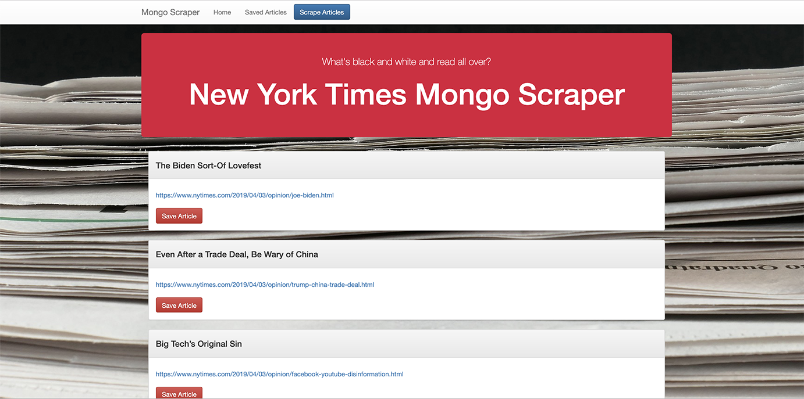

# MongoScraper

## **All the News That's Fit to Scrape**

**Overview**
In this assignment, I've created a web app that lets users view and leave comments on the latest news. I'm using Mongoose and Cheerio to scrape news from the New York Times.

**First things first**
 Create a GitHub repo and clone it to my computer. 
1. Run npm init. 
1. When that's finished, install and save these npm packages:
    1. *express*
    1. *express-handlebars*
    1. *mongoose*
    1. *cheerio*
    1. *axios*

NOTE: To earn complete credit, I must use all five of these packages in my assignment.

**Submission on BCS**
For grading purposes - this assignment must be deployed. 
* Please submit both the deployed Heroku link to your homework AND the link to the Github Repository!
Check them out here: https://quiet-sierra-73646.herokuapp.com/
and here: https://github.com/djreichel/MongoScraper

**Instructions**
Create an app that accomplishes the following:

Whenever a user visits, the app should scrape stories from a news outlet and display them for the user. Each scraped article should be saved to the application database. At a minimum, the app should scrape and display the following information for each article:
1. Headline - the title of the article
1. Summary - a short summary of the article
1. URL - the url to the original article
1. Feel free to add more content to your database (photos, bylines, and so on).

Users should also be able to leave comments on the articles displayed and revisit them later. The comments should be saved to the database as well and associated with their articles. Users should also be able to delete comments left on articles. All stored comments should be visible to every user.

**Create a README.md**
Add a README.md to your repository describing the project. You're reading it.

**Add to my portfolio**
After completing this homework please add the piece to my portfolio. 
Check it out here: https://djreichel.github.io/Bootstrap-Portfolio/portfolio.html
